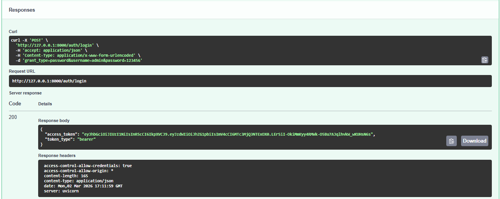
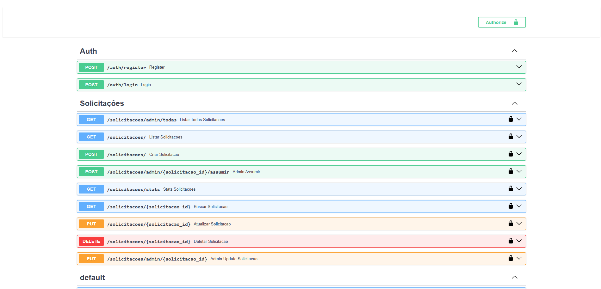
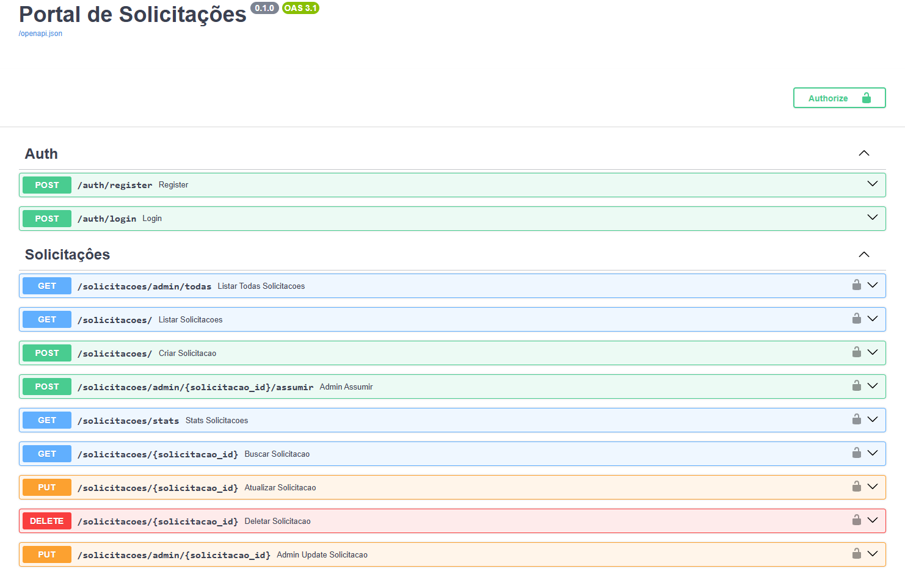
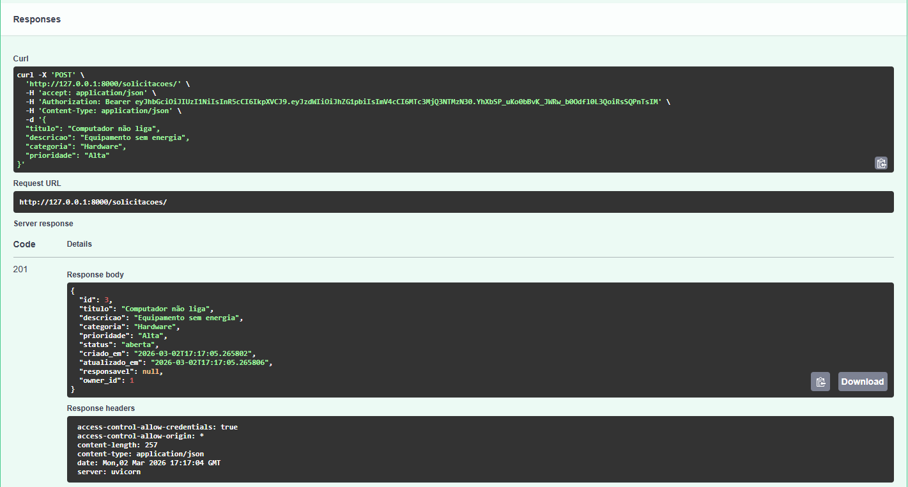
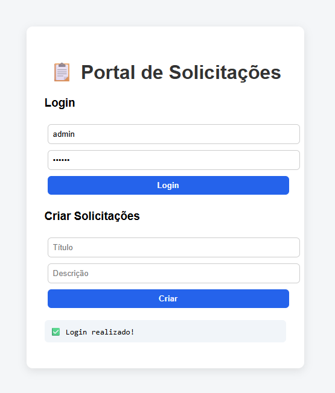
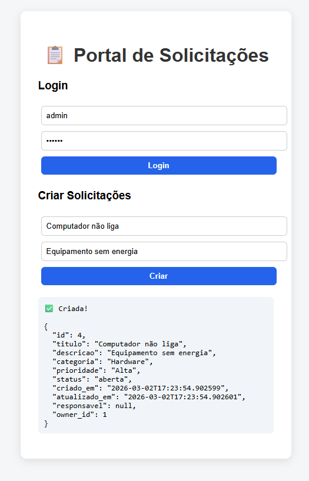

# 🚀 Portal de Solicitações

Sistema Full Stack para gerenciamento de solicitações internas, desenvolvido com **FastAPI**, autenticação **JWT** e interface web simples.

O projeto simula um ambiente corporativo onde usuários podem abrir solicitações e administradores podem gerenciá-las.

---

## 📌 Funcionalidades

✅ Cadastro e login de usuários  
✅ Autenticação com JWT (OAuth2 Password Flow)  
✅ Controle de acesso por perfil (User / Admin)  
✅ CRUD completo de solicitações  
✅ Assumir solicitações (admin)  
✅ Alteração automática de status  
✅ Estatísticas das solicitações  
✅ Interface Web integrada  

---

## 📸 Demonstração do Sistema

### 🔐 Autenticação JWT


### 🔑 Autorização via Swagger


### 📄 Visão Geral da API (Swagger)


### ✅ CRUD de Solicitações


### 💻 Interface Web


### 🧪 Interface Web em Execução


---

## 🧱 Arquitetura

Frontend (HTML + CSS + JavaScript)
↓
FastAPI REST API
↓
SQLAlchemy ORM
↓
SQLite Database


---

## 🛠️ Tecnologias Utilizadas

- Python
- FastAPI
- SQLAlchemy
- SQLite
- JWT Authentication
- OAuth2 Password Flow
- HTML
- CSS
- JavaScript (Fetch API)
- REST API

---

## 📂 Estrutura do Projeto


portal-solicitacoes-fastapi/
│
├── app/
│ ├── models/
│ ├── routes/
│ ├── database.py
│ └── main.py
│
├── frontend/
│ └── index.html
│
├── .gitignore
├── requirements.txt
└── README.md


---

## ⚙️ Como executar o projeto

### 1️⃣ Clonar o repositório

```bash
git clone https://github.com/ViniciusReis-Developer/portal-solicitacoes-fastapi.git
cd portal-solicitacoes-fastapi